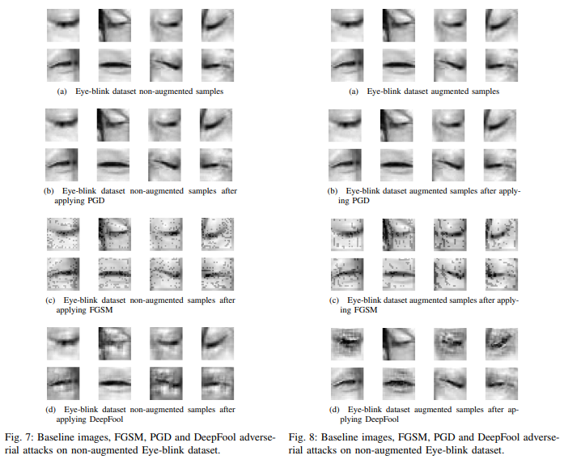
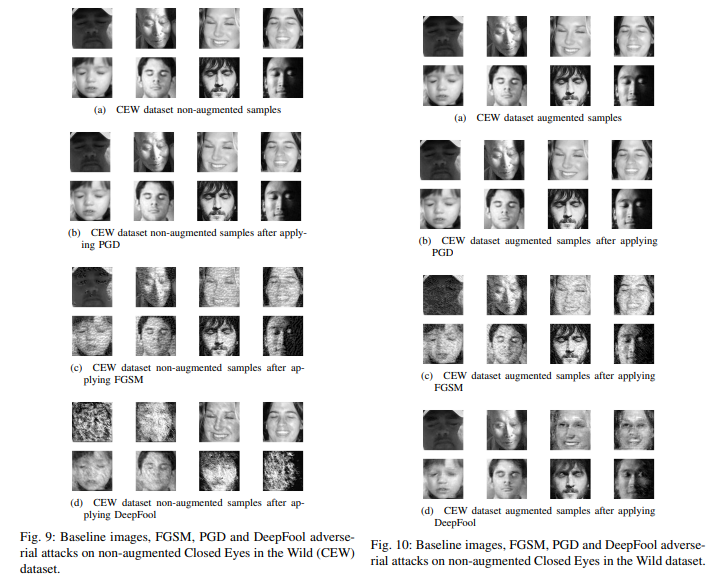

# Robust SleepNets
Yigit Alparslan and Edward Kim
This repo containts the source code for research paper "Robust SleepNets": https://arxiv.org/abs/2102.12555

## Highlights

Eye model results after adversarially attacking them.


Face model results after adversarially attacking them.


## Roadmap
- [x] Train classifier to detect eye closedness
- [x] Attack classifier with Projected Gradient Descent and report accuracies
- [x] Adversarially train and evaluate the classifier

## Citation
Please cite this paper as below:

```
@article{alparslan2021robust,
  title={Robust SleepNets},
  author={Alparslan, Yigit and Kim, Edward},
  journal={arXiv preprint arXiv:2102.12555},
  year={2021}
}
```
